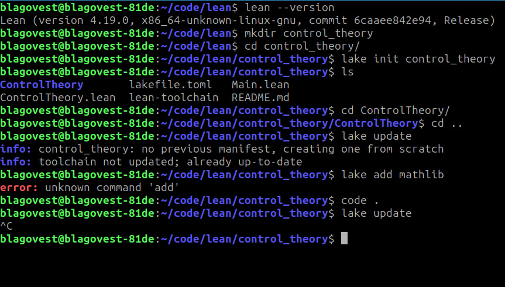
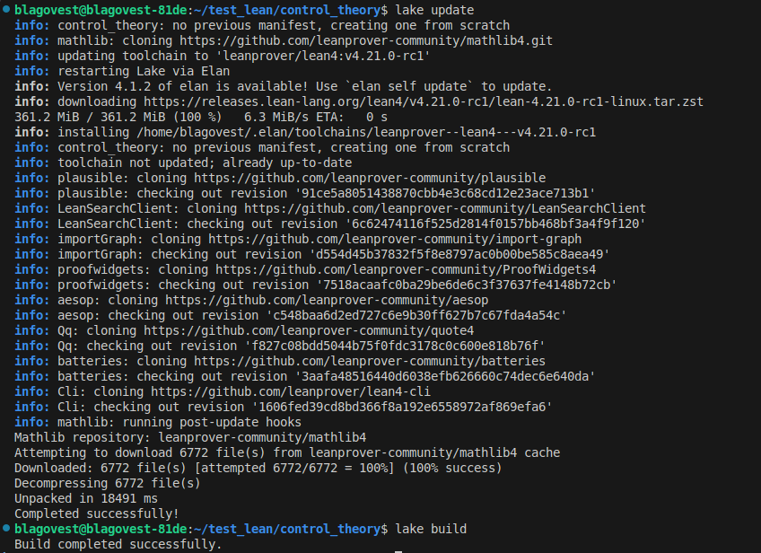
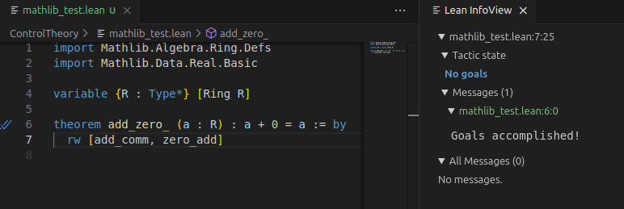
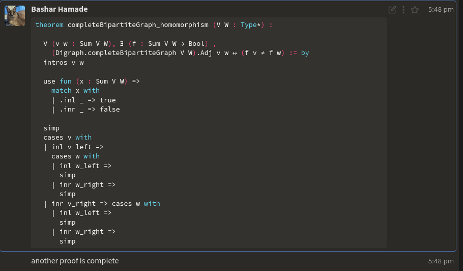
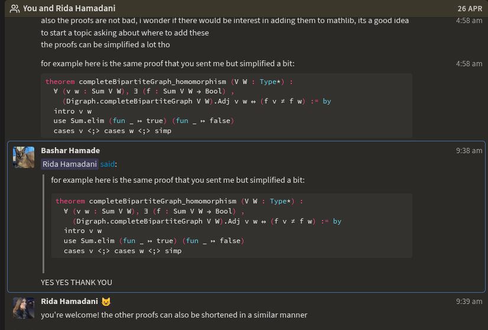

# Beginning of the Journey :

for any (somewhat big) Lean Project , we will need mathlib integration into our project . Here's a step by step guide to set up a Lean4 Project with Mathlib :


What we need :
1) Elan : tool for managing Lean installations, simplifying setup and updates, ensuring compatibility with projects like Mathlib. 

2) Lake : build system and package manager designed to manage Lean4 projects and their dependencies. It automates tasks like building packages, handling dependencies (e.g., Mathlib), and configuring project environments, using a lakefile.toml or lakefile.lean configuration file 

3) Editor : Preferrably VS Code (unless you are a vim enthusiast , I leave you to enjoy the torture of setting this up).
install Lean 4 extension in vs code and make sure all the requirements are satisfied.

now we can setup a project (I'll show the steps I follow to setup on Linux, may differ slightly on other systems): 
1) Open a terminal  
2) Check lean indeed installed :
```
$lean --version
``` 
3) create a new directory and change to it :
```
$mkdir control_theory 
$cd control_theory 
``` 
4) Initialise a new porject using lake :
```
$lake init control_theory
``` 
this will yield the following files : 
```
$ls  
Control Theory      lakefile.toml   Main.lean 
ControlTheory.lean  lean-toolchain  README.md
```  

5) Add the mathlib suppot to your lakefile.toml :
```
[[require]]
name = "mathlib"
git = "https://github.com/leanprover-community/mathlib4.git"
``` 

6) Sync Mathlib Dependencies  (I do these steps in vs code after opening my project with code .): 
```
lake update
lake build 
``` 
    
 
7) create a new file in 'ControlTheory' and test out if mathlib imports and the Lean extension works well, try this sample code : 
```lean4

import Mathlib.Algebra.Ring.Defs
import Mathlib.Data.Real.Basic

variable {R : Type*} [Ring R]

theorem add_zero_ (a : R) : a + 0 = a := by
  rw [add_comm, zero_add]

```  

this should yield such a result : 


(Warning : after writing the import statements, Lean will probably enter his freakout mode and keep spinning for a while until in actually renders everything and we can start seeing our proof infoview) 


Alright , I think now we can write some code (technically) , now we tackle how to actually write code that will work (hopefully). 


# Functional Programming in Lean : 

Lean follows a functional programming paradigm , with syntax similar to Coq and Ocaml for defining functions and such basic needs...
However for some reason they have line-indentation rules which makes it a bit annoying .

### <span style="color:red">If you are a Prog1 Instructor or/and a Caml enjoyer, you can skip through guiding yourself into the functional programming aspects in Lean</span>

However I can recomened this great standard book provided by the creators to guide and reference for Functional Programming in Lean : 

https://leanprover.github.io/functional_programming_in_lean/title.html 

<span style="color:red"> (P.S : My experience says that proving some programming structures is much easier than proving pure mathematical theorems (unless it is basic number theory) , so toying around with proving properties on structures like simple graphs feels great for beginners, while for some reason Eigenvalues are the devil and proving properties on them requires too much in the current mathlib implementations )


# The Basics : 

## 1) Theorems : 
####  *) Theorems as Functions: A theorem like ∀ x, P x is a function type x → P x, and its proof is a function producing a proof of P x for each x.  

```
def isEven (n : Nat) : Prop := n % 2 = 0

```

#### Predicates as Types: A predicate P : α → Prop is like a function returning a boolean, but proofs of P x are terms, not just true  

Predicates are functions from a type to Prop. For instance, isEven : Nat → Prop defines a property, and proving isEven 2 requires a term, not just true. 

```

theorem two_is_even : isEven 2 := by
  unfold isEven
  rfl

```

### Proofs as Terms: Writing a proof (e.g., ⟨hp, hq⟩ for p ∧ q) is like constructing a value of a product type in functional programming. 


### Theorems as Functions
In Lean4, theorems are propositions defined as types, often involving universal quantifiers (∀) or implications (→), which are represented as function types. A theorem of the form ∀ x : α, P x has the type x : α → P x, meaning its proof is a function that, given an x of type α, produces a proof of P x. This is analogous to functional programming, where a function of type α → β takes an input of type α and returns a value of type β. 


```
example (α : Type) (p q : α → Prop) : (∀ x : α, p x ∧ q x) → ∀ y : α, p y :=
  fun h : ∀ x : α, p x ∧ q x =>
  fun y : α =>
  show p y from (h y).left 
``` 
### Explicit and implicit types
```
theorem eq_refl {α : Type} (a : α) : a = a := rfl 
```
{α : Type} is implicit, inferred from a’s type when you write eq_refl 42 (Lean4 deduces α = Nat).
(a : α) is explicit, requiring you to provide a.

## 2) Tactics : 
### Common Lean Tactics

### 1. rfl (Reflexivity)
- **Purpose**: Closes goals of form `x = x` or definitionally true goals
- **Example**: 
    ```
    theorem  rfl_example (a : Nat) : a = a  := by
        rfl
    ```
- **Use case**: Resolving trivial equalities


### 2. rw [thm] (Rewrite)
- **Purpose**: Rewrites goal/hypothesis using a theorem or equation
- **Example**: 
    ```
    theorem  rw_example (a : Nat) : a + b = b + a  := by
        rw [Nat.add_comm]
        -- uses the commutative property of addition to rewrite 'a + b' as 'b + a'

    ```
- **Use case**: Simplifying expressions using equalities


### 3. exact term
- **Purpose**: Provides exact proof term matching goal's type
- **Example**: 
    ``` 
    def exact_example (f : A -> B ) (a : A) : B  := by
        exact (f a)

    ```
- **Use case**: Direct proof term application

### 4. apply thm
- **Purpose**: Reduces goal to theorem's premises
- **Example**: 
```
def apply_example (f : A -> B -> C ) (g : A -> B) (a : A) : C  := by
   apply f
   . exact a
   . apply g  -- or simply exact (g a)
     exact a 
```
- **Use case**: Backward reasoning from goal

### 5. intro x (Introduction)
- **Purpose**: Introduces variables into context
- **Example**: For `∀ x, p x`, use `intro x` to get goal `p x`
- **Use case**: Handling universal quantifiers/implications

### 6. induction x
- **Purpose**: Performs induction on variables
- **Example**: `induction n with | zero => ... | succ n ih =>`
- **Use case**: Proofs over recursive structures

### 7. cases h
- **Purpose**: Splits hypothesis into constructor cases
- **Example**:  
```
theorem cases_example  : forall a b c : Bool , a = b ∨ b = c ∨ a = c  := by

  intros a b c
  cases a with
  | true =>
    cases b with
    | true => exact Or.inl rfl
    | false => cases  c with
      | true =>
          apply Or.inr
          apply Or.inr
          rfl
      | false =>
          apply Or.inr
          apply Or.inl
          rfl

  | false =>
    cases b with
    | false =>

        apply Or.inl
        rfl
    | true => cases c with
      | true =>
          apply Or.inr
          apply Or.inl
          rfl
      | false =>
          apply Or.inr
          apply Or.inr
          rfl

```
- **Use case**: Breaking down complex hypotheses

### 8. simp (Simplify)
- **Purpose**: Applies simplification rules automatically
- **Example**: Resolves `n + 0 = n`
- **Use case**: Routine simplifications

### 9. linarith (Linear Arithmetic)
- **Purpose**: Solves linear arithmetic inequalities
- **Example**: Proves `x + 1 ≤ y → x < y`
- **Use case**: Numerical inequality proofs

### 10. assumption
- **Purpose**: Matches goal with existing hypothesis
- **Example**: Closes goal `p` when `hp : p` exists
- **Use case**: Direct hypothesis application


# 3) Proving Recursion Termination in Lean : 
In Lean4, termination of recursive functions is a strict requirement to ensure logical consistency in its dependently-typed system. Recursive functions must either use structural recursion (where recursive calls are made on structurally smaller arguments, like subterms of an inductive type) or well-founded recursion (where a well-founded relation guarantees no infinite descending chains). This is critical because Lean4’s type system, based on the Curry-Howard correspondence, treats functions and proofs uniformly, and non-terminating functions could lead to logical inconsistencies (e.g., proving false propositions). Below, I explain the technical details of proving termination in Lean4, using the gcd_simple function as an example, tailored for someone proficient in functional programming.

Termination in Lean4: Core Concepts
Structural Recursion: Lean4 automatically verifies termination for recursive calls on structurally smaller arguments, such as n in n + 1 for Nat. For example:
lean

```
def factorial : Nat → Nat
  | 0 => 1
  | n + 1 => (n + 1) * factorial n
```
Lean4 recognizes that n is a subterm of n + 1, ensuring termination.  

*)Well-Founded Recursion: For non-structural recursion, where the recursive call isn’t on a direct subterm, a well-founded relation $ r : \alpha → \alpha → Prop $ is required. 
Example : 
``` 
def gcd_simple (m n : Nat) : Nat := if m = 0 then n else gcd_simple (n % m) m
termination_by m
decreasing_by
  have h_not_zero : ¬m = 0 := by assumption
  apply Nat.mod_lt
  replace h_not_zero : m ≠ 0 := h_not_zero
  apply Nat.zero_lt_of_ne_zero
  exact h_not_zero


``` 


# 4) Using Mathlib in Lean4
Mathlib is Lean4’s standard library, offering a vast collection of formalized mathematics and programming constructs 

https://leanprover-community.github.io/mathlib4_docs/Mathlib 

https://leanprover-community.github.io/mathlib4_docs/Mathlib/Data/Matrix/Defs.html#Matrix 

https://leanprover-community.github.io/mathlib4_docs/search.html?q=eigenvalue 

The Matrix type is defined as:

```
def Matrix (m : Type u) (n : Type u') (α : Type v) : Type max u u' v :=
  m → n → α 
```
Parameters:
m : Type u: The type of row indices, with universe level u.
n : Type u': The type of column indices, with universe level u'.
α : Type v: The type of matrix entries (e.g., ℝ for real numbers), with universe level v. 

Return Type: The resulting type has universe level max u u' v, ensuring type safety across different universe levels.

Core Idea: A matrix is represented as a function from m to n to α, meaning for any i : m and j : n, A i j returns an element of type α. This functional representation is common in type theory, allowing matrices to be viewed as lookup tables. 

## Implementation of Matrices : 
```
import Mathlib.Data.Matrix.Basic
import Mathlib.Data.Real.Basic
import Mathlib.Data.Matrix.Notation

def myMatrix : Matrix (Fin 2) (Fin 3) ℝ :=
  Matrix.of (λ i j =>
    match i, j with
    | 0, 0 => 1.0
    | 0, 1 => 2.0
    | 0, 2 => 3.0
    | 1, 0 => 4.0
    | 1, 1 => 5.0
    | 1, 2 => 6.0)

#eval myMatrix 0 2

def myMatrix2 : Matrix (Fin 2) (Fin 3) ℝ :=
  !![1.0, 2.0, 3.0; 4.0, 5.0, 6.0]

#eval myMatrix2 1 1

#check myMatrix2 1 1


def myMatrix_clean : Matrix (Fin 2) (Fin 3) Float :=
  !![1.0, 2.0, 3.0;
     4.0, 5.0, 6.0]

#eval myMatrix_clean 1 2  -- outputs: 6.000000
```


sadly , there is a lot of trouble working with eigenvalues 


# 5) THE STANDARDS :

When implementing a library in Lean4 or contributing (to Mathlib) , one must adhere to the style guidelines as shown here for example :
https://leanprover-community.github.io/contribute/style.html 

https://leanprover-community.github.io/contribute/naming.html 

https://leanprover-community.github.io/contribute/doc.html


As an example , I would like to show the beautiful SimpleGraph implementation in Mathlib, and my not-so-beautiful attempt to contribute to it : 

check simplegraph.lean


 
 


6) Dependent Types in Lean4
Dependent types in Lean4 allow types to depend on values, enabling precise specifications and proofs, unlike standard functional programming languages like Haskell. They’re ideal for encoding invariants, such as matrix dimensions or state machine properties, crucial for control theory.


```lean
inductive Vector2 (α : Type) : Nat → Type
  | nil : Vector2 α 0
  | cons : α → Vector2 α n → Vector2 α (n + 1)

def append {α : Type} {m n : Nat} : Vector2 α m → Vector2 α n → Vector2 α (m + n)
  | Vector2.nil, ys => by
    rw [Nat.zero_add]
    exact ys
  | Vector2.cons x xs, ys => by
    rw [Nat.add_assoc]
    nth_rw 2 [Nat.add_comm]
    exact Vector2.cons x (append xs ys)

```